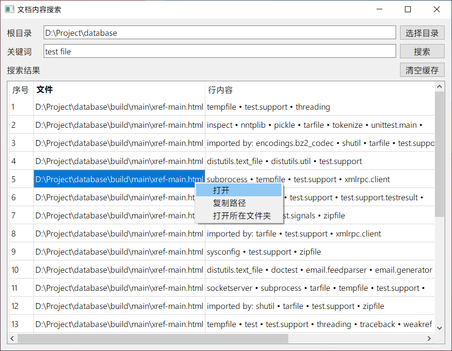

# Search in Doc
[中文文档](README-CN.md)

Search keywords in documents, support multi-keyword search. Double-click the search results to open the document directly, or right-click to copy the path of the document.

Developed with Python + PyQt5 + PyPandoc, supported document types: commonmark, docbook, docx, epub, haddock, html, latex, markdown, odt, opml, org, rst, t2t, textile, twiki

# Interface



# Usage

First, configure Pandoc locally and modify the Pandoc path in the main.spec file.

Use PyInstaller to package, execute the following command, and the packaged file is in the dist folder.

```bash
pyinstaller main.spec
```